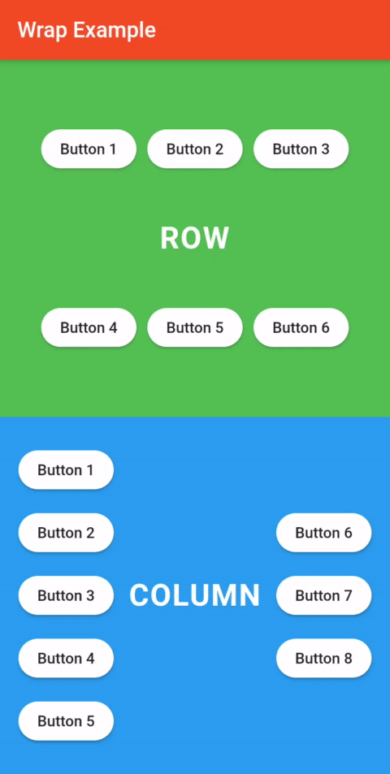

# Wrap - Deep Dive - Flutter

    

Learn more about the wrap widget which is like a multiline row or multiline column widget for your Flutter app.

### ⚡&ensp;Social Media

&ensp;Twitter: [@JohannesMilke](https://twitter.com/intent/follow?original_referer=https%3A%2F%2Fgithub.com%2FJohannesMilke&screen_name=JohannesMilke "Twitter Johannes Milke")

&ensp;Linkedin: [@JohannesMilke](https://linkedin.com/in/JohannesMilke "Linkedin Johannes Milke")

&ensp;Medium: [@JohannesMilke](https://medium.com/@JohannesMilke "Medium Johannes Milke")

### ✌&ensp;Preview

|              App Preview             |             Course Preview           |
| :----------------------------------: | :----------------------------------: |
|  |  |

### 📺&ensp;Watch Video
